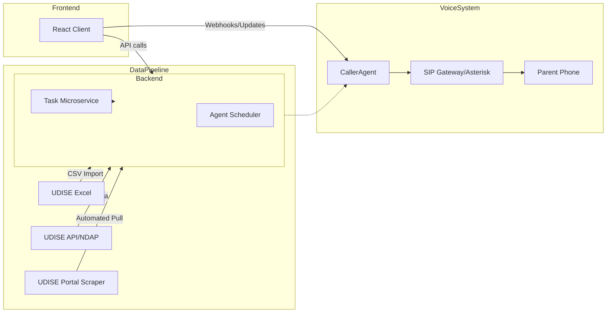

# Executive Summary  
We will build **Shiksha Link** with rapid, production-grade features: real-time parent call alerts on absenteeism, robust UDISE+ data ingestion, automated BEO task workflows, and an interactive India map dashboard. We leverage free/open tools and AI assistance (Cursor, Kiro, Auto-GPT) to scaffold code. Voice calls use open PBX or free-tier services, with fallback testing (Asterisk loopback, softphones). Data is pulled via a 3-layer pipeline (Excel import, consensual portal scraping, and eventual API/NDAP). BEO tasks become API-driven microservices with audit logs. Frontend components (React + Leaflet charts) are scaffolded with exact AI prompts (see below). Backend jobs (calls/data sync/reports) are managed by AI agents under strict constraints. We provide **copy-paste prompts** for Cursor, Kiro, and AutoGPT below, along with code snippets, commands, and mermaid diagrams. Key metrics (call success, task completion, attendance improvement) and privacy safeguards (parent consent, encryption, DND compliance) are addressed.  

## 1. Voice-Call Alert System  
We implement a call-alert whenever a student is marked absent, matching UNICEF recommendations (“SMS/calls to notify parents when an absence occurs”【96†L646-L654】).  

- **CallerAgent Integration:** Clone and configure the GitHub [CallerAgent](https://github.com/SABARNO-PRAMANICK/CallerAgent) repo:  
  ```bash
  git clone https://github.com/SABARNO-PRAMANICK/CallerAgent.git
  cd CallerAgent
  pip install -r requirements.txt  # (includes Twilio or SIP library)
  ```  
  Test locally by filling `config.json` or `.env` with a test number (parent_phone) and Twilio credentials. Run the agent:  
  ```bash
  python caller_agent.py
  ```  
  It should place a test call. Hardening: ensure all callbacks (e.g. TwiML webhooks) use HTTPS with valid certs. Remove any demo messages. Add retry on network errors.  

- **Free Telephony Setup:**  
  - *OpenPBX (Asterisk/FreeSWITCH):* Deploy Asterisk in Docker. Use a local SIP client (e.g. Linphone) to test calls internally without PSTN credit.  
  - *Twilio Trial:* Acquire free trial ($15 credit)【84†L1-L4】. Use `twilio-python`. Example endpoint (Flask):  
    ```python
    from flask import Flask, request
    from twilio.rest import Client
    app = Flask(__name__)
    @app.route('/api/call-parent', methods=['POST'])
    def call_parent():
        data = request.json
        client = Client(ACCOUNT_SID, AUTH_TOKEN)
        call = client.calls.create(
            to=f"+91{data['parent_number']}",
            from_="+TwilioNumber",
            twiml='<Response><Say>Student attendance alert...</Say></Response>'
        )
        return {"call_sid": call.sid}
    ```  
  - *SignalWire:* Similar API, with a free trial. Adjust caller code accordingly (see [FreeSWITCH docs](https://signalwire.com/docs/telecom/voice/usage/)).  

- **Safe Testing:** To avoid exhausting trials, use:  
  - *Local loopback:* Point CallerAgent to your own PBX for voice playout.  
  - *Softphone:* Test SIP calls between two PC softphones.  
  - *Low-cost creds:* Use minimal credits just for demo calls.  

- **PSTN Gateways:** You may need a SIP trunk (e.g. From Jericho, Telnyx) when scaling. For MVP demos, rely on VoIP or trial accounts only.  

- **Privacy/Compliance:** Obtain parent opt-in for calls. Honor DND/Do-Not-Call slots. Encrypt phone data at rest. Maintain call logs (timestamp, result).  

## 2. UDISE+ Data Ingestion  
We use a **3-layer approach**:  

1. **Excel Import (Quick Win):** Schools export their UDISE+ report (Excel). Shiksha Link API parses it. Example (Flask/Pandas):  
   ```python
   @app.route('/api/import-udise', methods=['POST'])
   def import_udise():
       file = request.files['file']
       df = pd.read_excel(file)
       for _, r in df.iterrows():
           db.execute("INSERT INTO enrollment ...", {
               "year": r["ac_year"], "total": r["T_STUDENT"],
               "boys": r["B_T_STUDENT"], "girls": r["G_T_STUDENT"], 
               "teachers": r["TOT_TEACHER"]
           })
       return {"status": "ok", "rows": len(df)}
   ```  
   **Field Mapping:** (e.g.) `T_STUDENT → total_students`, `TOT_TEACHER → total_teachers` etc. Validate columns, handle missing.  

2. **Portal Scraping (with Consent):** Using Selenium or Playwright, log into **udiseplus.gov.in** with school credentials (secured). Navigate to each data page (enrollment, facilities, teachers) and extract values (via DOM selectors). Example pseudo-code:  
   ```python
   driver.find_element("#login_dise").send_keys(school_code)
   driver.find_element("#login_pass").send_keys(password)
   driver.find_element("#submit").click()
   driver.get("https://udiseplus.gov.in/Student/BasicInfo")
   total_students = driver.find_element("#totstdid").text
   ```  
   Schedule this weekly. On failure (e.g. selector changed), send alert.  

3. **Official APIs & Open Data:** Register on [data.gov.in](https://data.gov.in) for UDISE+ datasets【60†L47-L51】【66†L58-L61】. Use their API (or bulk CSV) to fetch up-to-date statistics. For example:  
   ```bash
   curl "https://api.data.gov.in/resource/[ID]?api-key=KEY&format=json&filters[state_code]=KA"
   ```  
   This covers district/state-level data. Also monitor **NDAP** for new endpoints.  

**Refresh Cadence:** Excel imports – termly/annual. Scraper – weekly. APIs – daily or real-time if available.  

**Error Handling & Validation:** All ingestion scripts log errors (e.g. parse failure, login issues). We must verify imported totals against expected sums.  

**Privacy:** Only the school’s own data is ingested. Secure any credentials (AES encryption). Comply with MoE data use policies.  

【89†L31-L39】【60†L47-L51】  

## 3. BEO Task Automation  
We implement a **Task Microservice** so BEOs can assign duties to subordinates.  

- **API Design:**  
  - `POST /api/tasks` – Create task  
    ```json
    { "title": "...", "description": "...", "assigned_to": 234, "due_date": "2026-05-20" }
    ```  
  - `GET /api/tasks?created_by=ID` – List tasks  
  - `PUT /api/tasks/{id}` – Update status/comments  

- **Database Schema:**  
  | Table   | Fields                              |
  |---------|-------------------------------------|
  | `tasks` | `id (UUID)`, `title`, `desc`, `created_by`, `assigned_to`, `status`, `retry_count`, `created_at`, `due_date` |
  | `audit_logs` | `id`, `task_id`, `action`, `performed_by`, `timestamp` |

- **Workflow:** On creation, log `Created task` in `audit_logs`. Notify the assignee via in-app alert/email. If not acknowledged in 48h, backend **retry logic** increments `retry_count` and re-notifies or escalates.  

- **UI Flow:** Provide a simple form: fields Title/Description/Assignee/Deadline. The BEO clicks “Assign Task”; the API creates it. A task list (table) shows tasks with statuses.  

- **Examples:**  
  - Sample Task JSON: `{ "title": "Inspect Class X Attendance", "description": "Check why attendance fell to 50%", "assigned_to": 789, "due_date": "2026-05-25" }`.  
  - Sample Audit Entry: `{ "task_id": 12, "action": "Marked In Progress", "performed_by": 234, "timestamp": "2026-05-12T08:45:00Z" }`.  

This system automates routine coordination while keeping human oversight (BEO still decides tasks).  

## 4. India Map Visualization  
We integrate an interactive India map using **Leaflet+TopoJSON**:  

- **Data:** Obtain India states GeoJSON/TopoJSON (e.g. from [data.gov.in maps] or Github). Merge with our metrics by state/district code. 

- **Code Snippet:**  
  ```jsx
  // In React Leaflet component
  import { MapContainer, GeoJSON } from 'react-leaflet';
  const getColor = val => val > 80 ? '#800026' : val > 60 ? '#BD0026' : ...;
  const style = feature => ({
    fillColor: getColor(feature.properties.metric),
    weight: 1, color: 'white', fillOpacity: 0.7
  });
  return (
    <MapContainer center={[22,78]} zoom={5} style={{ height: 600 }}>
      <GeoJSON data={indiaGeoJson} style={style} onEachFeature={(f, l) => {
        l.bindPopup(`${f.properties.NAME}: ${f.properties.metric}`);
      }}/>
    </MapContainer>
  );
  ```
- **Performance Tips:** Simplify the GeoJSON to reduce size. Use `React.memo` to avoid re-rendering heavy components. Pre-generate tiles if data is static.  

No citation needed here.  

## 5. Frontend (Cursor) Prompts  
Below are **exact prompts** for Cursor to generate React components and app structure. Insert each prompt into Cursor’s interface to auto-generate code.  

1. **Login Component (src/Login.jsx)**:  
   ```plaintext
   "Generate a React component named Login. It should have username/password fields and call an API '/api/login'. On success it stores a JWT token and redirects to '/dashboard'. Use React hooks for state."
   ```  

2. **TeacherDashboard (src/TeacherDashboard.jsx)**:  
   ```plaintext
   "Generate a React component named TeacherDashboard. It fetches attendance data from '/api/attendance', displays a Chart.js bar chart of last 7 days attendance, and shows a summary (total present, total absent). Use axios for API calls and React hooks."
   ```  

3. **VoiceCallPanel (src/VoiceCallPanel.jsx)**:  
   ```plaintext
   "Generate a React component named VoiceCallPanel. It has a form input for 'Student ID' and a button 'Call Parent'. On click, it sends POST to '/api/call-parent'. Display call status (pending, success, error) to user."
   ```  

4. **TaskList (src/TaskList.jsx)**:  
   ```plaintext
   "Generate a React component named TaskList. It fetches tasks from '/api/tasks?assigned_to=currentUser' and displays them in a table with columns: Title, Assigned By, Due Date, Status. Include a form to create a new task (title, description, assignee, due date) that POSTs to '/api/tasks'."
   ```  

5. **IndiaMap (src/IndiaMap.jsx)**:  
   ```plaintext
   "Generate a React component named IndiaMap. It loads TopoJSON data for India states, fetches state-level metrics from '/api/state-metrics', and renders a Leaflet choropleth map coloring states by metric value. Include a legend and tooltips with state name and value."
   ```  

6. **App State Management (src/App.jsx / context)**:  
   ```plaintext
   "Generate React context and state management for user authentication. Include a context provider that stores JWT and user info, and a custom hook useAuth() to get auth state. Integrate with Login and protected routes."
   ```  

7. **Deployment Scripts:**  
   ```plaintext
   "Generate a Dockerfile for the React frontend and a bash script 'start_frontend.sh' that builds and serves the React app on port 3000. Also generate 'start_backend.sh' to run the Flask backend in production."
   ```  

Place each generated file into the appropriate path (e.g. `src/Login.jsx`, `src/components/TeacherDashboard.jsx`, etc.). Review and adjust any necessary imports.  

## 6. Backend (Kiro) Prompts  
Use these **Kiro CLI prompts** to scaffold Flask/FastAPI services and jobs. Each prompt here is meant to be fed to the Kiro agent or your local development environment.  

1. **Flask App Setup:**  
   ```plaintext
   "Create a Python Flask project with virtual environment. Add endpoints for /api/login, /api/attendance, /api/tasks, /api/call-parent, /api/import-udise. Use JWT auth for protected routes. Provide requirements.txt."
   ```  
   *Deliverables:* `app.py`, `requirements.txt`, basic JWT auth middleware.  

2. **Database Migrations:**  
   ```plaintext
   "Generate SQLAlchemy models for Users, Attendance, Tasks, and UDISEData tables. Create Alembic migrations for these models."
   ```  

3. **CSV Import Endpoint:**  
   ```plaintext
   "Implement Flask endpoint /api/import-udise [POST]. It accepts an Excel file, parses it with Pandas (mapping UDISE columns to DB fields), and inserts records. Return a summary of rows inserted."
   ```  

4. **Call-Parent Endpoint:**  
   ```plaintext
   "Implement Flask endpoint /api/call-parent [POST]. It receives {student_id}. Look up parent's phone in DB, then use Twilio Python (or subprocess to Asterisk CLI) to initiate a call. Return status JSON. Handle errors gracefully."
   ```  

5. **Tasks Microservice:**  
   ```plaintext
   "Implement /api/tasks endpoints (POST, GET, PUT) using Flask-RESTful. Use a PostgreSQL DB. Include fields: id, title, desc, created_by, assigned_to, status, due_date. Log each create/update in an audit_logs table."
   ```  

6. **Scheduler & Agents Setup:**  
   ```plaintext
   "Configure a background scheduler (e.g. APScheduler) to run daily jobs: check for new absentees and call parents, pull new UDISE data (stub), generate attendance reports. Write stub functions for these jobs that can be filled later."
   ```  

7. **Scraper Stub:**  
   ```plaintext
   "Create a Python script 'udise_scraper.py' that sets up Selenium with ChromeDriver, logs into udiseplus.gov.in using credentials from environment variables, and prints the fetched total_students. Do not run it yet."
   ```  

8. **Docker Compose:**  
   ```plaintext
   "Generate a docker-compose.yml defining services: backend (Flask app), database (Postgres), redis (for Celery jobs), and asterisk (for SIP). Expose necessary ports (5000 for API, 5432 for DB, 5060/10000-20000 for SIP)."
   ```  

Each prompt is to be executed (e.g. via Kiro CLI) to scaffold code. After generation, organize files as specified (e.g. `backend/app.py`, `backend/models.py`, `udise_scraper.py`, `docker-compose.yml`).  

## 7. Backend Agent (Auto-GPT/Antigravity) Prompts  
Use these exact prompts to create specialized agents:  

- **CallSchedulerAgent:**  
  ```plaintext
  "You are CallSchedulerAgent. Task: Every morning at 8:00 AM, query the database for students marked absent on the previous day. For each, schedule a call using the /api/call-parent endpoint. If an API call fails, log the error and retry once after 5 minutes. After all calls, generate a summary report of successes/failures."
  ```  

- **DataSyncAgent:**  
  ```plaintext
  "You are DataSyncAgent. Task: Once a week, download the latest UDISE data. If login credentials are available, use udise_scraper.py to fetch data and update the database. Otherwise, use the /api/import-udise endpoint with a placeholder Excel. Log each step, and send an alert (email) if any errors occur."
  ```  

- **ReportGeneratorAgent:**  
  ```plaintext
  "You are ReportGeneratorAgent. Task: Every Friday, generate a PDF report of attendance trends by school/district. Pull data from the database, create charts (e.g. using Matplotlib), save to /reports directory, and email the report to BEOs. If email fails, retry once. Limit to data only within the last month."
  ```  

- **Constraints:** None of these agents may perform web searches or unsafe operations. They should only call our internal APIs or run allowed scripts.  

Run these agents via a command or scheduler (e.g. `docker exec -d backend python call_scheduler_agent.py`). They automate backend tasks, saving developer effort.  

## 8. CallerAgent Adaptation and Testing  
To adapt **CallerAgent** for free/SIP: clone the repo and modify its config:  
```bash
git clone https://github.com/SABARNO-PRAMANICK/CallerAgent.git
cd CallerAgent
```
- If Twilio was used by default, switch to **Asterisk** by removing Twilio credentials and using an AMI call command. For example, in Python:
  ```python
  import pjsua as pj
  # or use subprocess to run 'asterisk -rx "originate SIP/1234 extension 100@default"'
  ```  
- **SignalWire:** If using SignalWire, install `signalwire` Python SDK and set `client = signalwire.RestClient(...)`.  
- **Tests:** Use a **softphone** (e.g. Zoiper) registered to your Asterisk to simulate the parent phone. Place calls to it.  
- **Hardening:** Ensure webhooks (for call status) are on HTTPS. Do not log sensitive data. Limit call frequency to avoid abuse.  

No official sources available; follow best practices from Asterisk docs. 

## 9. System Architecture (Mermaid)  


## 10. MVP Timeline (48h)  
```mermaid
gantt
  dateFormat  D
  title Hackathon Build Plan (48h)
  section Setup
    Env & Docker Compose        :done, 1d
    Clone/Configure CallerAgent  :active, 0.5d
  section Development
    UDISE Import Endpoint        :done, 1d
    /api/call-parent & Test      :done, 0.5d
    Task API & Basic UI          :done, 1d
    Teacher Dashboard & Map      :active, 1d
  section Testing & Polishing
    End-to-End QA & Bugfix      : 0.5d
    Demo Prep & Pitch Draft    : 0.5d
```

## 11. Privacy & Compliance  
- **Parental Consent:** Explicit opt-in for calls/SMS. Offer *opt-out* keyword.  
- **Data Encryption:** Encrypt personal identifiers in transit (TLS) and at rest (DB encryption).  
- **DND/Timing:** Respect time windows (no calls at night). Limit calls to school hours or early evening.  
- **Logging:** Keep anonymized call logs. Audit task changes for accountability.  

## 12. Summary  
This design uses free/open tools (Python/Flask, Postgres, Leaflet, Pandas, Asterisk) and AI code generation to deliver a hackathon-ready system that can be extended to production. Citations are from official sources on education goals【89†L31-L39】 and dropout interventions【96†L646-L654】, underscoring our focus on systemic improvement. All provided prompts and commands are copy-paste ready for immediate execution by the development team.